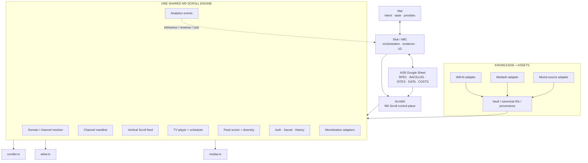
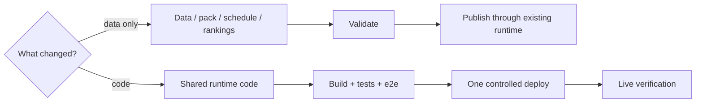

# Scroller / MS Scroll

> **One engine. Infinite channels.**

Scroller is the shared **Scroll + TV runtime** for the MS Scroll collection.

The architecture target is one configurable engine powering multiple channels without permanent UI/runtime forks:

- **https://scroller.tv** — mixed discovery / random / serendipity
- **https://wikai.tv** — knowledge / encyclopaedia
- **https://mediai.tv** — generated and curated media

The three current specialist codebases are being converged through shared contracts and adapters rather than a big-bang rewrite.

## Core architecture



## Rebuild contract

A channel should be reproducible from:

```text
MSSCROLL master spec
+ channel manifest
+ canonical item/data access
+ reusable asset references
+ shared engine code
+ environment/provider config
= reproducible channel
```

A new channel is primarily **configuration + data**, not a copied Next.js application.

## Human source of truth

The portfolio source of truth is the **AI26 Google Sheet**:

https://docs.google.com/spreadsheets/d/1W612nquUIzCEWMVCsIsWi1gweh1lG4bU9AqMg5FSUl0/edit

Key IDs:

- `MSSCROLL` — collection/master spec
- `MSS-*` — executable backlog items
- `scroller | wikai | mediai` — initial channel IDs
- canonical `item_id` — identity across Scroll, TV, metrics and monetisation
- `POM-*` — 24-minute TV programming slots

## Documentation

Start with [`docs/README.md`](./docs/README.md).

Canonical documents:

- [`docs/MS-SCROLL-MASTER-SPEC.md`](./docs/MS-SCROLL-MASTER-SPEC.md) — product + architecture contract
- [`docs/MS-SCROLL-ABC-DIAGRAMS.md`](./docs/MS-SCROLL-ABC-DIAGRAMS.md) — detailed ABC architecture atlas
- [`docs/MS-SCROLL-BACKLOG.md`](./docs/MS-SCROLL-BACKLOG.md) — `MSS-*` implementation backlog mirror
- [`docs/SCROLLAI-ULTIMATE-DIAGRAM.md`](./docs/SCROLLAI-ULTIMATE-DIAGRAM.md) — 1G / portfolio / monetisation architecture
- [`docs/PRD-ALIGNMENT.md`](./docs/PRD-ALIGNMENT.md) — PRD alignment notes
- [`docs/MOBILE-V16.md`](./docs/MOBILE-V16.md) — mobile implementation reference

Diagram standard:

- local: [`skills/abc-diagrams/SKILL.md`](./skills/abc-diagrams/SKILL.md)
- canonical skills repo: `flexappdev/skills-2026/claude-code/projects/abc-diagrams/SKILL.md`

## Product contract

### Mobile default

Mobile opens in immersive **Scroll** mode unless a channel manifest explicitly overrides it.

### Universal shell

All channels converge on:

- sticky header;
- vertical snap feed;
- sticky five-button footer: **Home · Explore · Gen · Saved · Me**;
- one-tap **Scroll ↔ TV** mode switching;
- stable canonical item identity across modes;
- channel theming by tokens/config rather than duplicate components.

### Modes

- **Scroll** — immersive vertical feed.
- **TV / Live** — continuous programmed playback.
- **Latest** — newest eligible content.
- **Top** — day/week/month/year/all-time, including Top 100 → Top 10 → Top 1.

## Feed algorithm v1

Start explainable before adding heavier ML/personalisation.

```text
score =
  quality
+ freshness
+ interest
+ novelty
+ diversity
+ completion/engagement
+ controlled serendipity
- repetition penalty
- ineligible/low-quality penalty
```

Hard caps prevent immediate repetition and excessive same-topic/source clustering.

Channel manifests tune weights:

- `scroller.tv` — strongest serendipity/mixed-source weighting;
- `wikai.tv` — knowledge quality + topical continuity;
- `mediai.tv` — media completeness + playability.

## TV programming

Canonical programming unit: **24-minute POM**.

- 60 POMs/day = exactly 24 hours.
- 21,900 slots/year.
- The content library may exceed schedule capacity; the current stretch target is 24K+ reusable units.
- Schedule rows reference canonical item IDs rather than duplicating media.

The annual schedule skeleton lives in AI26 → `TV 2026`.

## Content factory

```text
Ingest
→ Normalize + dedupe
→ Article/context
→ Rank/List/Top 100
→ Images
→ Audio
→ Video
→ QA + eligibility
→ Schedule/publish
→ Analytics + revenue/cost
→ refresh/rerank winners
```

**Reuse first.** Existing WIKAI, MediaAI, Vault, Mongo, S3 and source assets should be reused before generating new paid media.

## ScrollAI

Canonical local skill:

[`skills/scrollai/SKILL.md`](./skills/scrollai/SKILL.md)

Core commands:

```text
/scrollai
/scrollai <topic>
/scrollai plan <topic>
/scrollai build <topic> --count 100
/scrollai refresh <slug>
/scrollai status [slug]
/scrollai daily
```

A topic creates a **pack/data object**, not a new application.

Pack minimum:

```text
data/scrollers/<slug>/
  manifest.json
  page.md
  items.json
```

## Agent model

```text
Mat ↔ Skai / ABC
       ↓
     AI26
       ↓
   ScrollAI
  ↙  ↓  ↓  ↘
WIKAI MediaAI ListAI VaultAI
 AppAI  BOAI  CostAI
       ↓
 shared runtime + evidence
       ↓
 AI26 / ABC feedback
```

- **ABC / Skai** — orchestration, priorities, evidence, portfolio state.
- **ScrollAI** — MS Scroll product/feed/TV/publish owner.
- **AppAI** — shared runtime engineering.
- **BOAI** — private operational control.
- **WIKAI** — knowledge/provenance adapter.
- **MediaAI** — media asset factory/adapter.
- **ListAI** — ranked/list structures.
- **VaultAI** — canonical IDs/context/provenance.
- **CostAI** — cost/profitability inputs.

## Monetisation / 1G

Commercial KPI: **$100/day gross revenue**. It is a target, not a guarantee.

Initial shared-engine monetisation:

- AdSense for eligible anonymous traffic;
- Amazon/contextual affiliate links;
- travel/commercial affiliates when relevant;
- later: sponsors/direct offers/membership only when evidence supports them.

```text
gross = ads + affiliate + direct
net   = gross - hosting - generation/provider cost
```

Missing telemetry remains **Unknown**, never zero.

The winning loop is:

```text
useful content
→ traffic
→ engagement
→ revenue
→ subtract cost
→ profitability score
→ ABC priority
→ refresh / scale proven winners
```

## Deployment circuit breaker



Do not redeploy per item. Do not fork per topic/domain.

## Live/private operations

Private operations include the `/live` cockpit and protected APIs where implemented. The target Back Office should expose:

- three-channel health;
- source/content inventory;
- channel manifests;
- eligibility/publish state;
- TV schedule;
- tasks/backlog evidence;
- analytics;
- revenue;
- cost/profitability.

Do not report provider telemetry that has not been connected/verified.

## Run locally

```bash
cp .env.example .env.local
npm install
npm run dev
```

Default local Scroller port: `25000`.

## Validation

For pack/data changes:

```bash
npm run scroller:validate
```

For shared runtime changes:

```bash
npm run build
npm run test:e2e
```

Then verify the affected live domain(s) before attaching evidence to the `MSS-*` backlog item.

## Contribution / architecture rule

When a decision changes architecture:

1. update AI26 (`MSSCROLL` + impacted `MSS-*` rows);
2. update the master spec;
3. update the relevant ABC diagrams;
4. update backlog acceptance/dependencies;
5. implement code/config/data;
6. validate/test/live-check;
7. attach evidence;
8. only then mark DONE.

See the full visual contract in [`docs/MS-SCROLL-ABC-DIAGRAMS.md`](./docs/MS-SCROLL-ABC-DIAGRAMS.md).
