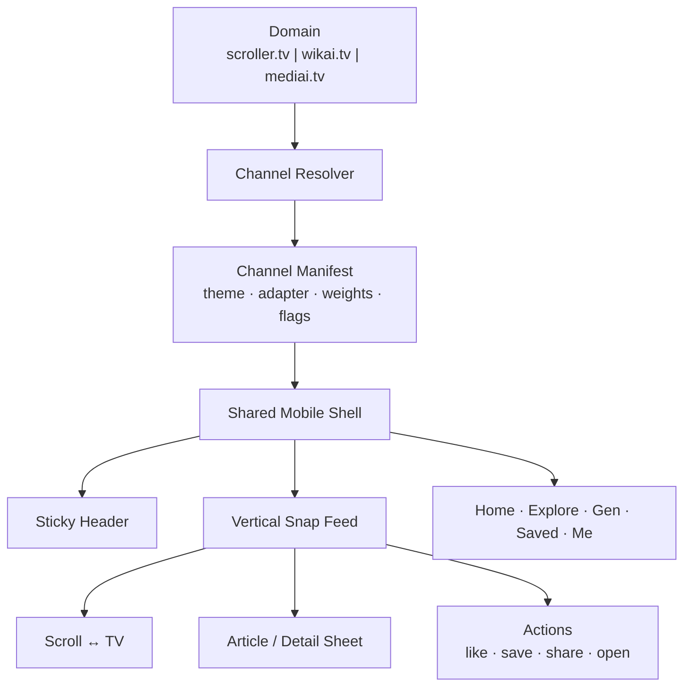
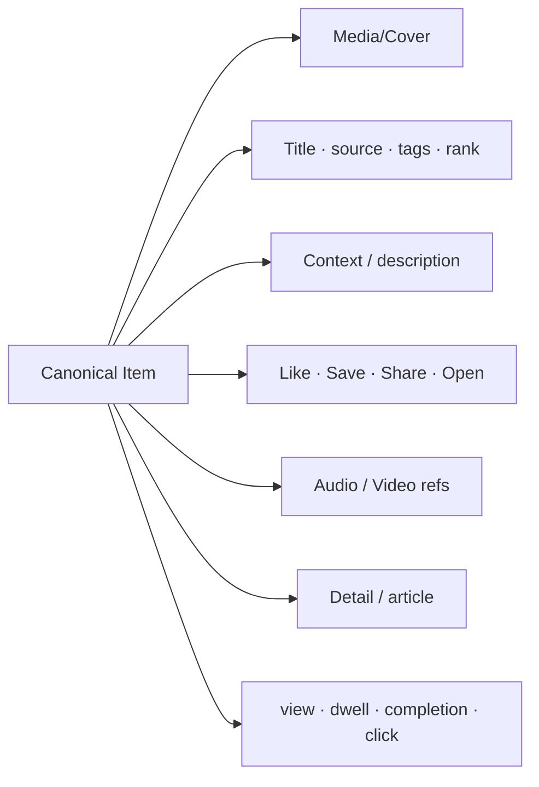
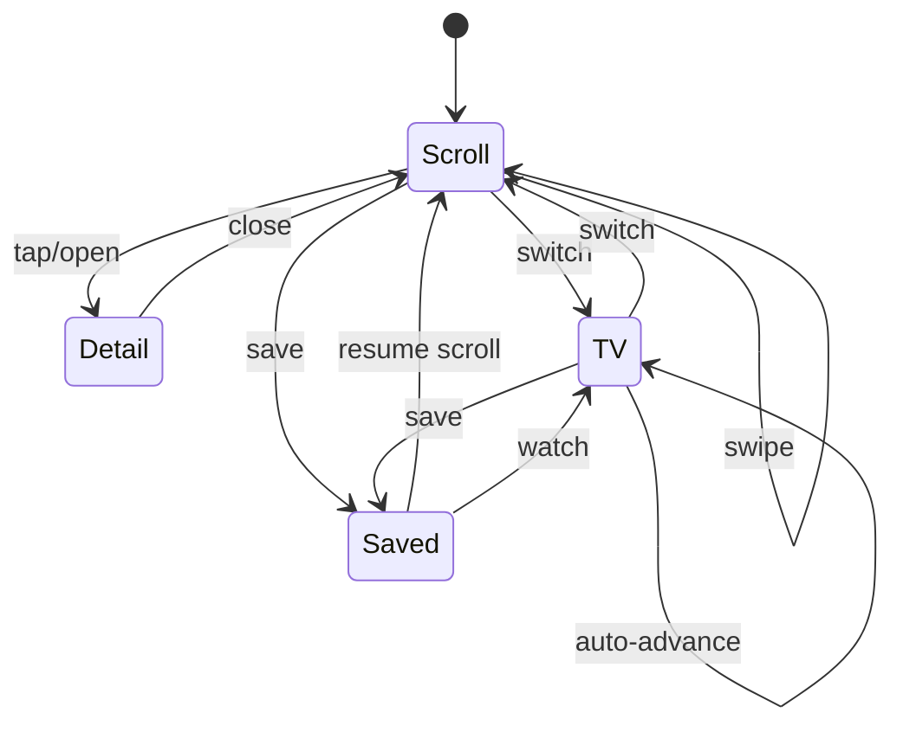
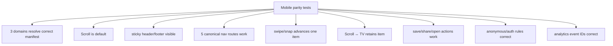

# MS Scroll — Mobile UX Reference

> Historical origin: the earlier Scroller v2.6 / WIKAI v1.6 mobile-port work.  
> Current source of truth: `docs/MS-SCROLL-MASTER-SPEC.md`.  
> Detailed architecture: `docs/MS-SCROLL-ABC-DIAGRAMS.md`.

The old port plan remains useful as implementation history, but the current product contract is no longer “copy the WIKAI feed.” The goal is one shared mobile Scroll/TV experience driven by channel manifests and canonical items.

## Current mobile contract



### Rules

- Mobile default = **Scroll** unless the manifest explicitly overrides it.
- Scroll is full-height and snap-based.
- TV is one tap away and retains the same canonical item identity.
- Sticky footer destinations are always **Home · Explore · Gen · Saved · Me**.
- The centre `Gen` action is visually emphasised.
- Header/footer/shell are shared engine components; channel differences come from configuration.
- Item state such as save/history should survive mode changes where authentication/storage allows it.
- No channel should permanently fork the interaction model simply because its content source differs.

## Card anatomy



Every card is a presentation of the canonical item, not a separate source-specific identity.

## Mode state



The `item_id` remains stable across Scroll, Detail, Saved and TV.

## Ranking and mobile feed

The mobile feed should consume the shared feed algorithm rather than implement a separate WIKAI-only order.

```text
candidate items
→ eligibility/provenance gate
→ channel-specific weights
→ quality + freshness + interest + novelty + diversity
→ repetition/source caps
→ ordered feed
→ viewer events
→ aggregate feedback
```

`scroller.tv` raises serendipity; `wikai.tv` raises knowledge continuity; `mediai.tv` raises playability/media completeness.

## Performance expectations

The old port plan identified valid risks that still matter:

- avoid giant single-file feed components;
- keep above-the-fold interaction fast;
- lazy/dynamic load expensive readers/players where appropriate;
- preserve image/media fallbacks;
- verify on a representative mobile Playwright device;
- avoid letting sticky chrome cover content/actions;
- keep transitions stable when switching Scroll ↔ TV.

## Test matrix



## Historical implementation notes

The earlier v2.6 idea was to port the shape of WIKAI's `Feed.tsx`, `Cover.tsx` and `StructuredArticle.tsx` into Scroller. That work demonstrated the desired interaction language, but the current architecture changes the implementation strategy:

- **then:** copy/adapt WIKAI components into Scroller;
- **now:** make the best interaction model part of the shared MS Scroll engine;
- **then:** adapt heterogeneous card unions into a WIKAI-shaped feed item;
- **now:** normalize sources into the canonical item contract;
- **then:** Scroller and WIKAI could continue as separate UI runtimes;
- **now:** WIKAI becomes a specialist knowledge adapter/channel personality behind shared UX.

Historical commit/version details remain available in Git history and should not override the current `MSSCROLL` contract.

## Cross-references

- `docs/MS-SCROLL-MASTER-SPEC.md`
- `docs/MS-SCROLL-ABC-DIAGRAMS.md`
- `docs/MS-SCROLL-BACKLOG.md`
- `skills/abc-diagrams/SKILL.md`
