# MS Scroll ABC Diagram Atlas

**Collection:** `MSSCROLL`  
**Principle:** **One engine → N channels**  
**Human source of truth:** AI26 Google Sheet  
**Implementation mirror:** `flexappdev/scroller`  
**Diagram standard:** `skills/abc-diagrams/SKILL.md`

This is the canonical architecture atlas for the MS Scroll collection. It complements:

- `docs/MS-SCROLL-MASTER-SPEC.md`
- `docs/MS-SCROLL-BACKLOG.md`
- `docs/SCROLLAI-ULTIMATE-DIAGRAM.md`

Target/WIP components are shown as architecture intent and must not be interpreted as production-complete without test/live evidence.

---

## 0. Executive view — human × AI factory

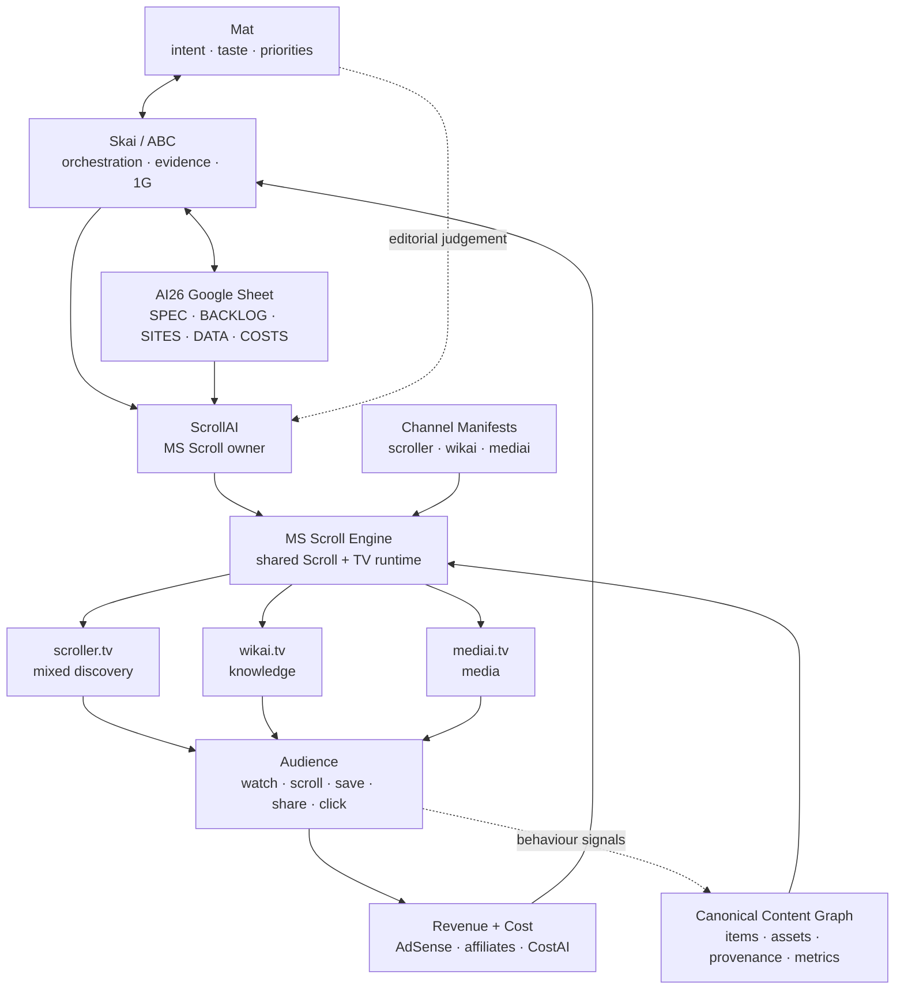

**Question answered:** who collaborates with whom, and where does the feedback return?

---

## 1. One engine → N channels

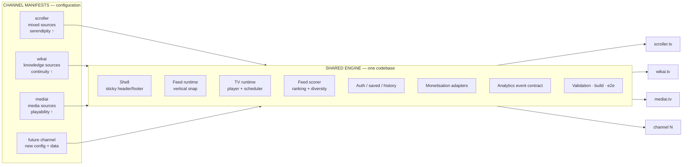

**Hard boundary:** domain/topic differences must not create permanent shell/feed/TV forks.

---

## 2. Rebuild-from-spec contract

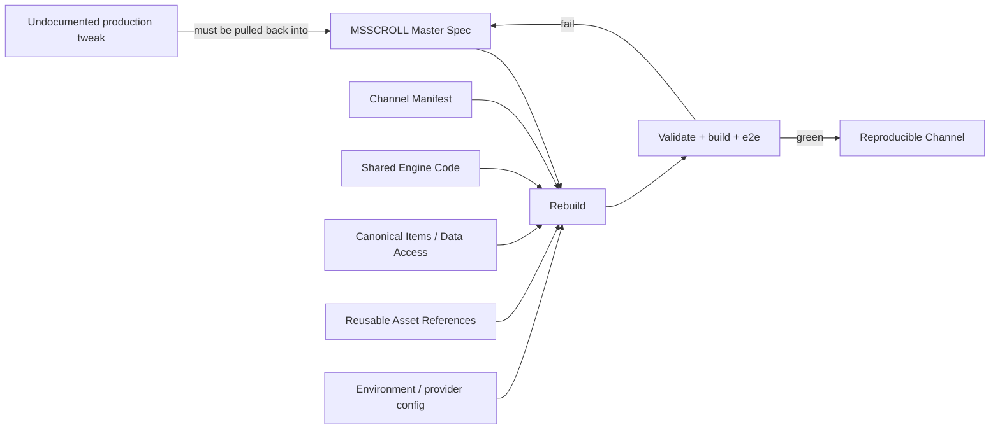

Acceptance requires functional parity, not merely a successful compile.

---

## 3. Request/runtime resolution

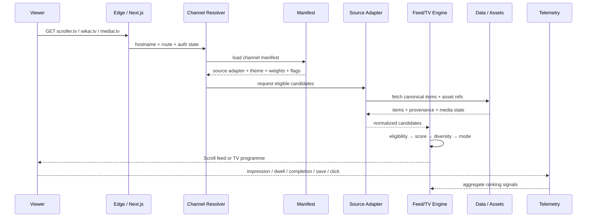

A domain resolves configuration; it does not select a separate application fork.

---

## 4. Canonical content/data graph

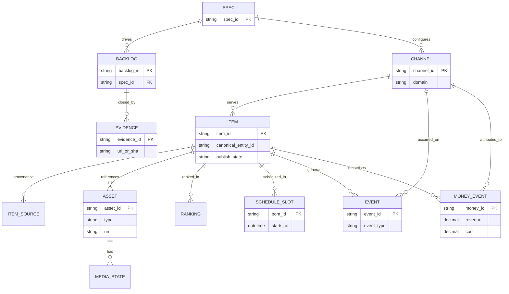

**Rule:** join systems with stable IDs before adding a dedicated graph database.

---

## 5. Content factory — reuse first

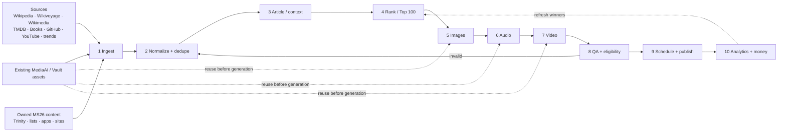

**Cost rule:** Page + List must be useful before expensive media generation.

---

## 6. Feed algorithm v1

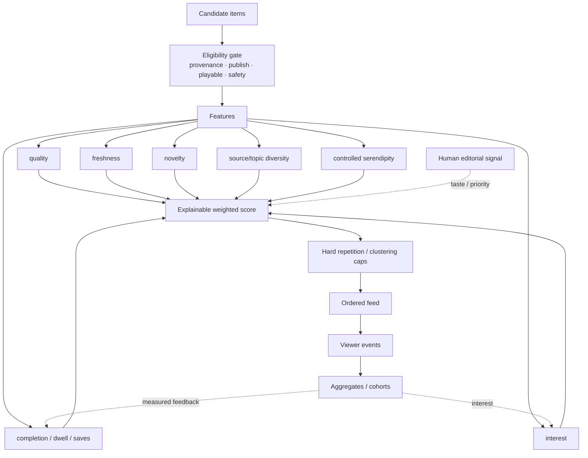

Channel manifests alter weights, not the scoring architecture.

---

## 7. Scroll ↔ TV state model

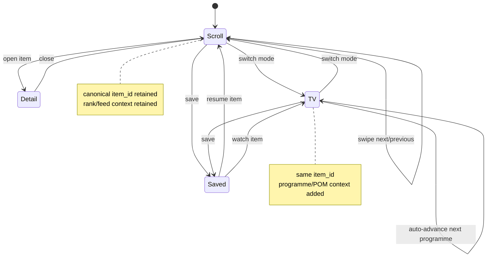

Mode changes must not manufacture a second identity for the same content item.

---

## 8. 24-hour TV programming

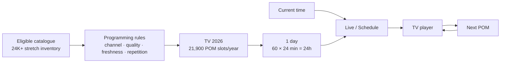

```text
00:00–00:24  POM 01
00:24–00:48  POM 02
...
23:36–00:00  POM 60
```

The catalogue can be larger than the linear schedule to allow rotation, replacement and QA failures.

---

## 9. ABC / agent ownership

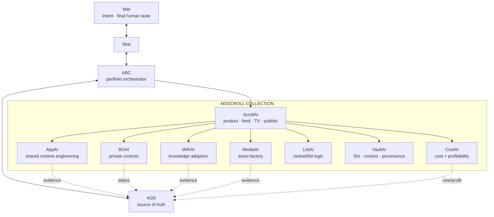

ABC orchestrates; specialist agents own their bounded capabilities.

---

## 10. Monetisation / 1G feedback loop

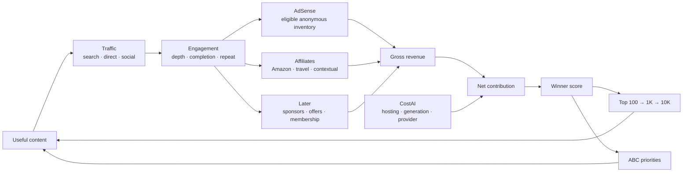

**1G:** `$100/day gross` is a target, never an assumed result. Missing telemetry remains unknown, not zero.

---

## 11. Deployment circuit breaker

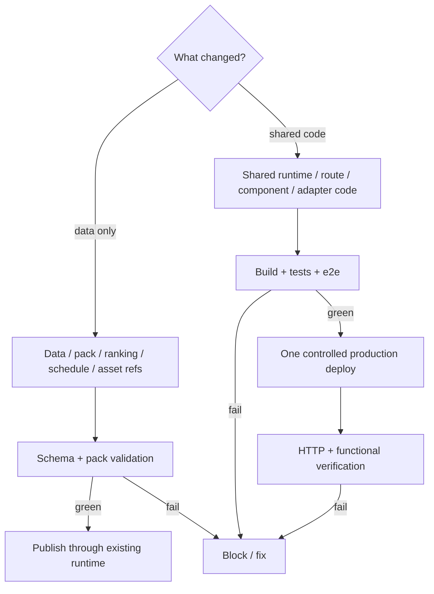

No per-item redeploys. No per-topic app forks.

---

## 12. Current → target migration

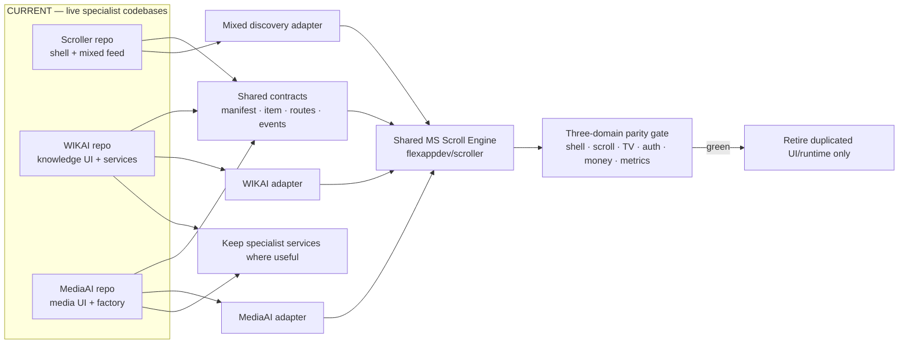

Migration is adapter-first, not a freeze-and-rewrite programme.

---

## 13. Spec → backlog → evidence sync

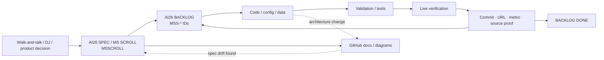

A task is DONE only when evidence returns to the source-of-truth backlog.

---

## 14. Mobile product anatomy

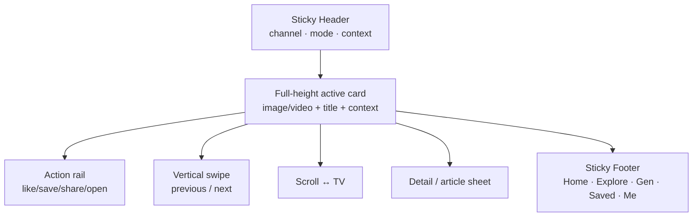

Mobile default is Scroll unless a channel manifest explicitly overrides it.

---

## 15. Documentation graph

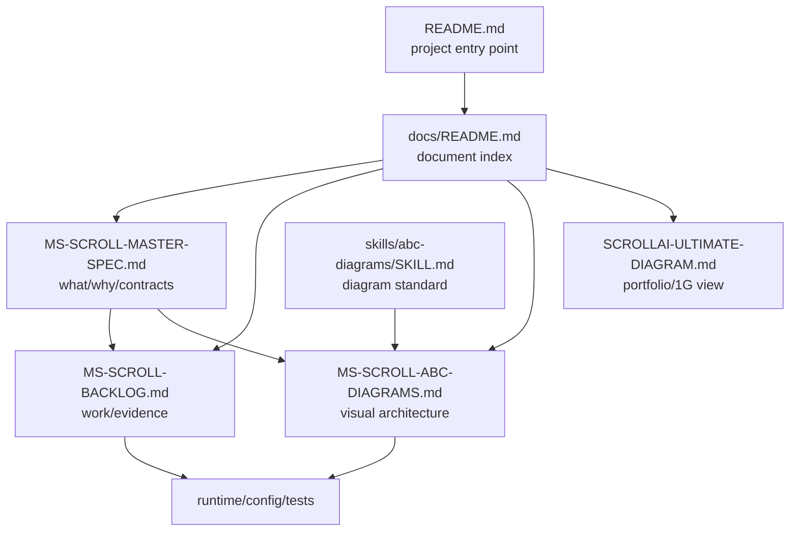

---

# Maintenance contract

When an architecture decision changes:

1. update AI26 (`MSSCROLL` and affected `MSS-*` rows);
2. update `MS-SCROLL-MASTER-SPEC.md`;
3. update the relevant diagrams in this atlas;
4. update `MS-SCROLL-BACKLOG.md` dependencies/acceptance criteria;
5. change code/config/data;
6. validate/test/live-check;
7. attach evidence back to AI26;
8. only then mark DONE.

The diagrams are part of the implementation contract, not a post-hoc illustration.
