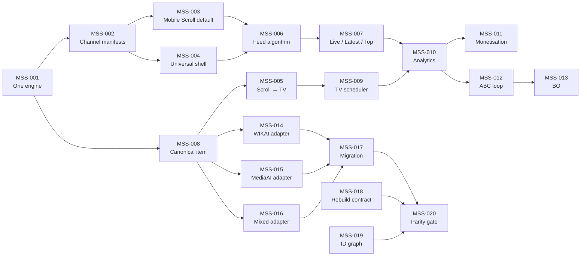
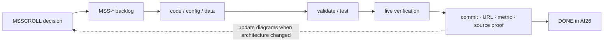

# MS Scroll Shared Backlog

**Collection:** `msscroll`  
**Spec:** `MSSCROLL`  
**Source of truth:** AI26 Google Sheet → `BACKLOG` tab  
**Mirror purpose:** implementation handoff for GitHub/Codex/Claude Code agents.

AI26: https://docs.google.com/spreadsheets/d/1W612nquUIzCEWMVCsIsWi1gweh1lG4bU9AqMg5FSUl0/edit

Master spec: `docs/MS-SCROLL-MASTER-SPEC.md`  
Diagram atlas: `docs/MS-SCROLL-ABC-DIAGRAMS.md`  
Diagram skill: `skills/abc-diagrams/SKILL.md`

## Rules

- Shared items use `Applies To = ALL`.
- Create site-specific child work only when behaviour truly differs.
- A backlog item is DONE only with evidence: commit, test, live URL, measured result, or source-data proof as appropriate.
- Spec changes must update impacted `MSS-*` items.
- Architecture-changing backlog work must update the affected ABC diagrams in the same change.
- AI26 wins if this mirror drifts.

## Dependency map

## Current backlog

| ID | Status | Pri | Area | Applies to | Item | Definition of done / next |
|---|---|---:|---|---|---|---|
| MSS-001 | WIP | P0 | Engine | ALL | One engine → N channels | All 3 domains render from shared runtime/manifests with no duplicated shell/feed/TV code. Define migration boundaries. |
| MSS-002 | DO | P0 | Spec | ALL | Executable channel manifest | Config covers domain, source adapter, default mode, theme, ranking, monetisation, analytics and feature flags. |
| MSS-003 | DO | P0 | UX | ALL | Mobile Scroll default | Mobile opens immersive Scroll by default; TV is one tap away; override remains configurable. |
| MSS-004 | DO | P0 | UX | ALL | Universal sticky shell | Shared sticky header + Home / Explore / Gen / Saved / Me footer across all channels. |
| MSS-005 | DO | P0 | Product | ALL | Scroll ↔ TV dual mode | Same canonical item/context survives mode switch. |
| MSS-006 | DO | P0 | Feed | ALL | Feed algorithm v1 | Explainable scorer combines quality, freshness, interest, novelty, diversity, engagement and controlled serendipity with repetition caps. |
| MSS-007 | DO | P0 | Modes | ALL | Live / Latest / Top | Common contract across all 3 domains; Top supports time windows and Top 100/10/1. |
| MSS-008 | DO | P0 | Data | ALL | Canonical content item schema | One stable item contract joins article/list/code/media/provenance/quality/schedule/money/metrics. |
| MSS-009 | WIP | P0 | TV | ALL | 21,900-slot TV scheduler | 60 × 24-minute POM/day schedule references canonical reusable items. Wire BO + runtime. |
| MSS-010 | DO | P0 | Analytics | ALL | Shared event schema | Impression/view/completion/dwell/depth/open/save/share/play/click/revenue/cost events carry channel + item IDs. |
| MSS-011 | DO | P0 | Money | ALL | Monetisation adapters | AdSense + affiliate logic at engine level with correct logged-in/anonymous rules and attributable telemetry where available. |
| MSS-012 | DO | P0 | ABC | ALL | ABC orchestration loop | ABC reads spec/backlog/site/data/cost state, delegates to agents and writes evidence/status back. |
| MSS-013 | DO | P1 | BO | ALL | One operational Back Office | Edit manifests, eligibility, feed weights, schedule, tasks, analytics, revenue, cost and publish state from one private surface. |
| MSS-014 | DO | P0 | Adapter | wikai.tv | WIKAI adapter | Existing wiki content becomes shared items with attribution; no WIKAI shell fork required. |
| MSS-015 | DO | P0 | Adapter | mediai.tv | MediaAI adapter | Existing asset bundles are referenced by shared items; generation remains a separate media-factory concern. |
| MSS-016 | WIP | P0 | Adapter | scroller.tv | Mixed discovery adapter | Channel mixes qualified MS26 sources with source diversity and serendipity while preserving provenance. |
| MSS-017 | DO | P0 | Migration | ALL | Merge without big-bang rewrite | Extract shared runtime, wrap specialist data as adapters, reach parity, then retire duplicate UI/runtime code. |
| MSS-018 | DO | P0 | Rebuild | ALL | Rebuild-from-spec contract | Clean environment reconstructs channel from spec + manifest + data/assets and passes validation/build/e2e. |
| MSS-019 | DO | P1 | Graph | ALL | Knowledge graph by IDs, not new DB | Stable IDs/relations connect spec/backlog/channel/item/asset/schedule/metrics before adding graph infrastructure. |
| MSS-020 | DO | P0 | QA | ALL | Three-domain parity gate | Automated smoke/e2e covers auth, shell, Scroll, TV, modes, ranking invariants, rendering, monetisation and manifests on all domains. |

## First execution sequence

1. **MSS-001** — lock one-engine migration boundaries.
2. **MSS-002** — create the 3 channel manifests.
3. **MSS-008** — freeze canonical item interface and adapter mapping.
4. **MSS-004 + MSS-003 + MSS-005** — make the shared UX shell authoritative.
5. **MSS-014/015/016** — attach WIKAI, MediaAI and mixed-discovery adapters.
6. **MSS-006 + MSS-007** — standardise feed ranking and modes.
7. **MSS-009** — connect TV programming to the shared runtime.
8. **MSS-010 + MSS-011** — close analytics/monetisation feedback loop.
9. **MSS-012 + MSS-013** — operate it from ABC/BO.
10. **MSS-020** — parity gate before retiring old runtime code.

## Evidence loop

## 1G priority

Do not wait for the full merge to monetise. Preserve current live domains while extracting the shared engine behind them. Revenue work and migration work should meet at the engine adapters, not through a freeze-and-rewrite programme.
