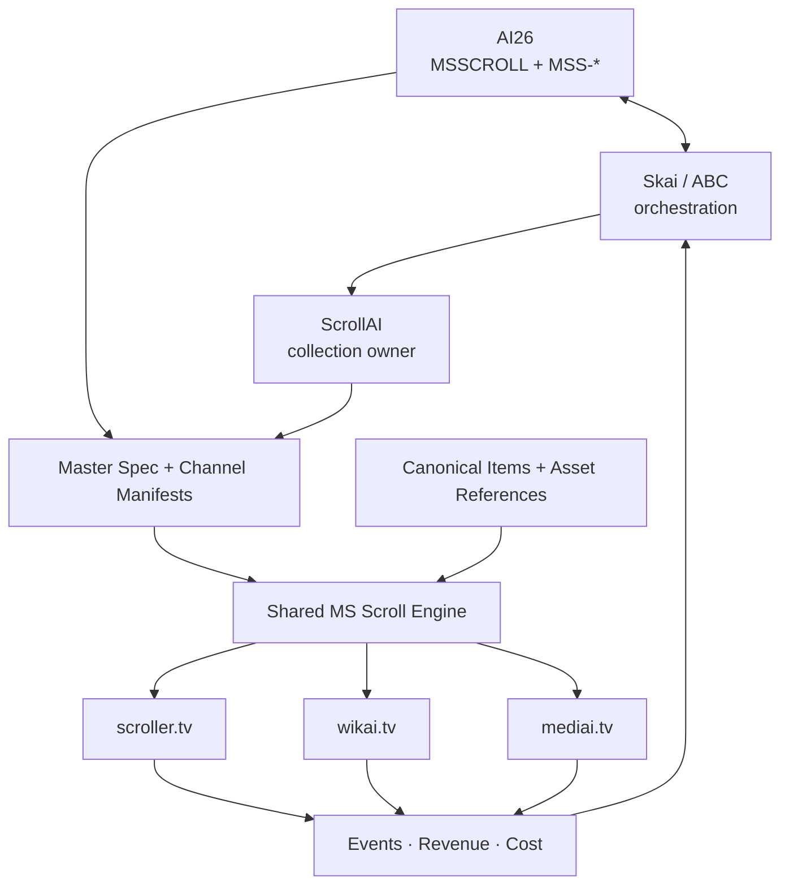
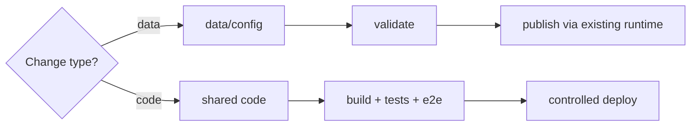
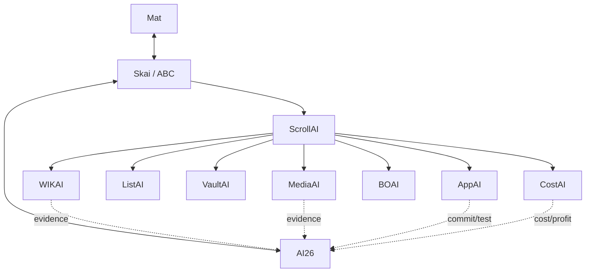
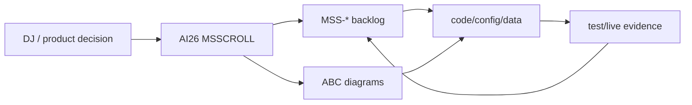

# MS Scroll Master Spec v1

**Spec ID:** `MSSCROLL`  
**Collection:** `msscroll`  
**Title:** MS Scroll Engine  
**Tagline:** **One engine. Infinite channels.**  
**Status:** WIP / architecture locked  
**Human source of truth:** AI26 Google Sheet  
**Implementation mirror:** `flexappdev/scroller`

AI26: https://docs.google.com/spreadsheets/d/1W612nquUIzCEWMVCsIsWi1gweh1lG4bU9AqMg5FSUl0/edit

Backlog: `docs/MS-SCROLL-BACKLOG.md`  
Detailed diagrams: `docs/MS-SCROLL-ABC-DIAGRAMS.md`  
Diagram standard: `skills/abc-diagrams/SKILL.md`

---

## Architecture at a glance



Full architecture atlas: `docs/MS-SCROLL-ABC-DIAGRAMS.md`.

---

# Description

MS Scroll is one configurable Scroll + TV runtime that powers `scroller.tv`, `wikai.tv`, `mediai.tv`, and future channels without copying the application shell or maintaining a separate runtime per domain.

A channel must be reproducible from:

1. this master spec;
2. one channel manifest;
3. canonical content/item data;
4. reusable asset references;
5. shared engine code;
6. environment/provider configuration.

A new channel is primarily **configuration + data**, not a new application fork.

## Tags

`MS Scroll`, `Scroller`, `TV`, `AI`, `feed`, `vertical video`, `knowledge`, `media`, `monetisation`, `ABC`

## Ten keywords

`scroll`, `TV`, `feed`, `random`, `live`, `latest`, `top`, `knowledge`, `media`, `monetisation`

---

# Top 10 Spec

## 1. Goal

Build one engine that powers N channels and can rebuild any channel from spec + manifest + canonical data/assets.

**Hard rule:** no permanent per-domain shell/feed/TV forks.

Success means the same shared runtime can resolve a domain/channel manifest and render the appropriate content personality without copying the application architecture.

## 2. Users

Support anonymous and signed-in viewers, plus private operator surfaces.

- Mobile-first consumption.
- **Mobile default = Scroll** unless a channel manifest explicitly overrides it.
- TV remains one tap away.
- Logged-in users can retain saves, history and preferences.
- Operator/admin routes remain private.
- Human editorial judgement remains a deliberate ranking signal rather than being replaced by automation.

## 3. Apps / Channels

The first three manifests are:

- `scroller.tv` — mixed discovery / serendipity.
- `wikai.tv` — knowledge / encyclopaedia.
- `mediai.tv` — generated and curated media.

They share the engine and differ through configuration such as:

```yaml
id: scroller | wikai | mediai
domain: scroller.tv | wikai.tv | mediai.tv
defaultMobileMode: scroll
sourceAdapter: mixed | wiki | media
theme: channel theme tokens
feedWeights: channel-specific ranking weights
features: channel flags
monetisation: channel/provider config
analytics: shared event contract
```

Future MS Scroll channels must use the same manifest contract unless the spec is explicitly revised.

## 4. Product

Every qualified content object can be:

- scrolled;
- watched;
- ranked;
- scheduled;
- saved;
- shared;
- monetised;
- measured.

Core modes:

- **Scroll** — immersive vertical feed.
- **TV / Live** — continuous programmed playback.
- **Latest** — newest valid content.
- **Top** — best by day/week/month/year/all-time, including Top 100 → Top 10 → Top 1.

The same canonical `item_id` must survive switching modes.

## 5. UX

The universal shell should provide:

- immersive vertical snap feed;
- sticky header;
- sticky five-button footer: **Home · Explore · Gen · Saved · Me**;
- one-tap Scroll ↔ TV switching;
- stable item/topic context while switching modes;
- fast Home refresh/randomisation;
- dark-first Scroller experience;
- channel theming through tokens, not duplicated components.

The ambition is TikTok/YouTube-level simplicity while remaining an original product.

See the mobile and state diagrams in `docs/MS-SCROLL-ABC-DIAGRAMS.md`.

## 6. Engine

The shared runtime owns:

- Next.js app shell;
- domain/channel resolver;
- channel manifests;
- source adapters;
- canonical feed/card renderer;
- feed scorer;
- TV player and scheduler;
- authentication hooks;
- Saved/history interfaces;
- monetisation adapters;
- analytics adapters;
- private Live/BO surfaces;
- validation/build/e2e gates.

### Deployment rule

**Data changes do not create new app builds.**

Content, rankings, schedules and asset references flow through data/config. Runtime deploys happen only when shared code changes.



## 7. Data

Stable IDs join the whole graph:

```text
SPEC → BACKLOG → CHANNEL → ITEM → LIST/RANK → ARTICLE
                         ↘ ASSET → SCHEDULE → EVENT → REVENUE/COST
```

Canonical content item fields include, where applicable:

- `item_id` / slug / canonical topic/entity id;
- title;
- tagline;
- description;
- tags;
- list/rank, including Top 100 membership;
- article/context;
- optional code/demo;
- image/audio/video references;
- provenance/licence/source URL;
- created/refreshed timestamps;
- quality state;
- channel eligibility;
- publish state;
- monetisation metadata;
- analytics/revenue/cost references.

Reuse existing Mongo, Supabase, WIKAI, MediaAI and Vault boundaries. Do not duplicate binaries simply to make the shared engine work.

Start with stable IDs/relations before adding a dedicated graph database.

## 8. Agents

ABC/Skai is the orchestration layer above the collection.



Responsibilities:

- **ABC / Skai** — priorities, orchestration, evidence, portfolio state.
- **ScrollAI** — MS Scroll product/runtime/feed/programming owner.
- **WIKAI** — knowledge adapters and attribution.
- **MediaAI** — media bundles/assets and generation state.
- **ListAI** — ranked/list structures and commercial list opportunities.
- **VaultAI** — canonical IDs/context/provenance.
- **AppAI** — shared engine/repo/build/deploy engineering.
- **BOAI** — private operational editing/control surfaces.
- **CostAI** — hosting/generation cost and profitability inputs.

Agents update AI26 by stable IDs and attach evidence instead of creating parallel truth stores.

## 9. Money

Monetisation is implemented once at engine level.

Initial stack:

- AdSense for eligible anonymous traffic;
- affiliate links where contextually relevant;
- travel/commercial affiliate adapters where relevant;
- later: sponsorship, direct offers, subscription/membership only when evidence supports them.

Rules:

- logged-in feeds stay ad-free where currently specified;
- never invent provider revenue when telemetry is missing;
- track revenue by channel/item where provider granularity permits;
- track hosting/generation cost alongside gross revenue;
- **1G target = $100/day gross revenue**, not a guaranteed outcome.

## 10. Metrics

Measure the human + AI feedback loop:

- sessions/reach;
- item impressions/views;
- dwell/watch time;
- completion rate;
- scroll depth;
- opens;
- saves;
- shares;
- repeat use;
- media plays;
- outbound clicks;
- conversions/commission;
- AdSense/affiliate/direct revenue;
- RPM/conversion rate;
- generation cost;
- hosting cost;
- net contribution.

Feed measured performance back into ranking/programming while retaining human editorial taste as an explicit signal.

---

# Feed Algorithm v1

Start explainable and deterministic before heavier ML/personalisation.

```text
quality
+ freshness
+ inferred/user interest
+ novelty
+ diversity
+ completion/engagement signal
+ controlled serendipity
- repetition penalty
- low-quality/ineligible penalty
```

Hard constraints prevent:

- immediate repetition;
- excessive same-topic clustering;
- excessive same-source clustering;
- broken/incomplete media;
- content that fails provenance or publish eligibility.

Channel personalities:

- `scroller.tv` — strongest serendipity/mixed-source weighting;
- `wikai.tv` — knowledge quality and topical continuity;
- `mediai.tv` — media completeness, quality and playability.

Detailed feed loop: `docs/MS-SCROLL-ABC-DIAGRAMS.md`.

---

# TV / Programming

Canonical unit: **24-minute POM**.

- 60 POMs/day = exactly 24 hours.
- 21,900 schedule slots/year.
- Content library target can exceed the linear schedule capacity to allow rotation/replacement.
- Schedule rows reference canonical items/programmes; they do not duplicate media.

The engine exposes **Live/Schedule**, **Latest** and **Top** consistently across all channels.

---

# Migration: three codebases → one engine

Do **not** use a big-bang rewrite.

## Phase 1 — Contract

1. Lock canonical channel manifest.
2. Lock canonical item schema.
3. Lock shared route/UX/analytics contracts.

## Phase 2 — Shared runtime

Extract or retain in `flexappdev/scroller`:

- shell/nav;
- feed/card renderer;
- Scroll/TV state;
- scorer;
- scheduler/player;
- auth integration points;
- analytics/monetisation adapters.

## Phase 3 — Adapters

Wrap existing systems rather than rewriting them first:

- WIKAI becomes a knowledge/source adapter.
- MediaAI becomes a media/library adapter.
- Scroller becomes the mixed-discovery adapter.

## Phase 4 — Domain parity

Route all three domains through the shared runtime/channel resolver and pass a parity matrix for:

- shell/nav;
- Scroll;
- TV;
- Live/Latest/Top;
- Saved/auth behaviour;
- source/content rendering;
- analytics;
- monetisation rules;
- private operational routes.

## Phase 5 — Retire duplication

Only after parity and e2e are green should duplicated WIKAI/MediaAI UI/runtime code be retired. Specialist data/media services can remain independent where useful.

Migration diagram: `docs/MS-SCROLL-ABC-DIAGRAMS.md`.

---

# Rebuild-from-spec contract

A clean environment should reconstruct a channel with:

```text
MS-SCROLL-MASTER-SPEC.md
+ channel manifest
+ canonical item/data access
+ reusable asset references
+ shared engine repository
+ environment/provider config
= reproducible channel
```

The rebuild is accepted only if validation/build/e2e demonstrate functional parity. Manual undocumented production tweaks are drift and must be pulled back into spec/config.

---

# Source of truth and sync rule

**AI26 remains the human source of truth.**

- `SPEC` identifies the collection-level spec.
- `MS SCROLL` contains the compact master-spec view and operating plan.
- `BACKLOG` contains executable work items keyed `MSS-*`.
- `SITES` contains domain/runtime metadata.
- `DATA` contains source catalogue.
- `COSTS` contains cost inputs.
- `TV 2026` contains the annual programme skeleton.
- GitHub documents mirror the implementation contract for engineers/agents.

When a spec decision changes:

1. update AI26 master spec;
2. add/update impacted `MSS-*` backlog rows;
3. update the relevant detailed diagrams;
4. update repo spec/config/code;
5. validate/test/live-check;
6. attach commit/live/test evidence to backlog;
7. only then mark the item DONE.



Backlog mirror: `docs/MS-SCROLL-BACKLOG.md`  
Diagram atlas: `docs/MS-SCROLL-ABC-DIAGRAMS.md`
