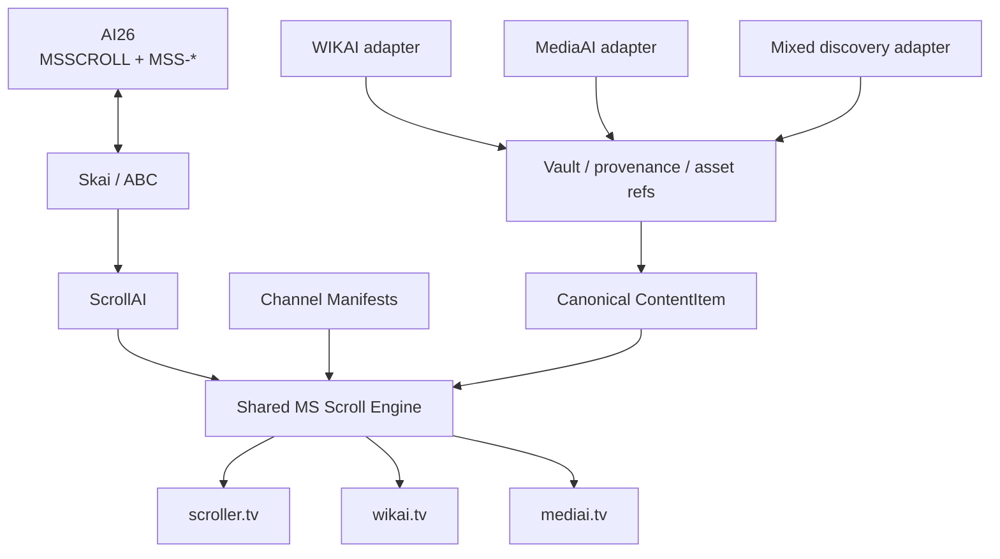
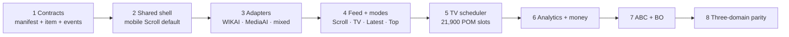
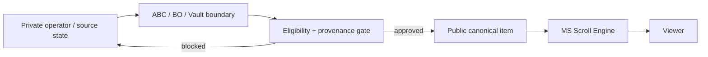
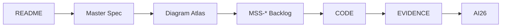

# Scroller — PRD Alignment

**Current collection spec:** `MSSCROLL`  
**Human source of truth:** AI26  
**Implementation mirror:** `flexappdev/scroller`  
**Detailed diagrams:** `docs/MS-SCROLL-ABC-DIAGRAMS.md`

This document preserves the useful intent of the earlier 2026-09-02 PRD and maps it into the current MS Scroll architecture. The current master contract is `docs/MS-SCROLL-MASTER-SPEC.md`; if this document conflicts with it, the master spec wins.

## What survived from the original PRD

The strongest decisions remain valid:

- Scroller is an experience/distribution plane, not a one-off site.
- Do **not** build a new Scroller application for every site/topic.
- Normalize heterogeneous content into one canonical item contract.
- Reuse WIKAI/MediaAI/Vault assets rather than duplicating binaries.
- Separate public runtime concerns from private data/operator concerns.
- Standardize navigation and analytics once at engine level.
- Prove configurability with WIKAI/MediaAI as adapters rather than copying UI.

## Current target architecture



## Original PRD concepts → current MSSCROLL mapping

| Original concept | Current contract | Backlog |
|---|---|---|
| One reusable Scroller per-site config | One engine → N channel manifests | `MSS-001`, `MSS-002` |
| Universal content item | Canonical item + stable IDs | `MSS-008`, `MSS-019` |
| WIKAI as first proof of config | WIKAI adapter | `MSS-014` |
| Media generation boundary | MediaAI adapter / asset refs | `MSS-015` |
| Mixed sources | scroller.tv discovery adapter | `MSS-016` |
| Five-button nav | Shared sticky shell | `MSS-003`, `MSS-004` |
| Universal analytics | Shared event schema | `MSS-010` |
| Monetisation | Engine-level adapters | `MSS-011` |
| ABC orchestration | AI26 + ABC evidence loop | `MSS-012` |
| Admin/CMS | One operational BO | `MSS-013` |
| Configurability test | Rebuild-from-spec | `MSS-018` |
| Safe migration | Adapter-first migration + parity gate | `MSS-017`, `MSS-020` |

## Current foundation sequence



The priority is architectural leverage, not a cosmetic rewrite.

## Public/private boundary

The public runtime must receive only eligible/public data and asset references.



Public clients must never gain direct access to private Vault/operator data merely because a source adapter can access it server-side.

## Canonical item direction

The earlier nine-shape `Card` model should converge toward one shared interface at the engine boundary. Source-specific loaders/adapters may remain specialized behind that contract.

```text
source-specific record
→ adapter
→ canonical item
→ eligibility
→ Scroll / TV / Latest / Top
→ event + revenue/cost attribution
```

## Current UX contract

- mobile default = Scroll;
- sticky header;
- sticky footer = **Home · Explore · Gen · Saved · Me**;
- one-tap Scroll ↔ TV;
- same item identity across modes;
- channel personality comes from manifest/theme/ranking weights;
- desktop may add a rail but does not invent a second navigation model.

## What is now superseded

The following old implementation assumptions are historical rather than current architecture:

- version-specific v2.x/v3.x port plans;
- hard-coded port/version references;
- copying WIKAI's huge mobile component verbatim as the long-term architecture;
- direct Mongo/S3 access as the intended final public data boundary;
- per-codebase UX divergence as a permanent state.

Keep old commits for history; do not use them as the current rebuild contract.

## Definition of done for alignment

A new engineering agent should be able to:

1. read `README.md`;
2. read `docs/MS-SCROLL-MASTER-SPEC.md`;
3. inspect `docs/MS-SCROLL-ABC-DIAGRAMS.md`;
4. identify the relevant `MSS-*` backlog item;
5. understand shared engine vs adapter vs channel manifest boundaries;
6. implement without creating another runtime fork;
7. return commit/test/live evidence to AI26.


