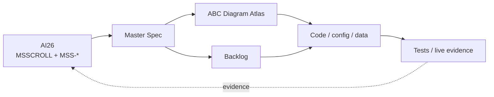

# Scroller / MS Scroll Documentation

This folder contains the implementation-grade documentation for the `MSSCROLL` collection and the shared Scroller runtime.

## Start here

1. [`MS-SCROLL-MASTER-SPEC.md`](./MS-SCROLL-MASTER-SPEC.md) — collection-level product and architecture contract.
2. [`MS-SCROLL-ABC-DIAGRAMS.md`](./MS-SCROLL-ABC-DIAGRAMS.md) — canonical detailed architecture diagram atlas.
3. [`MS-SCROLL-BACKLOG.md`](./MS-SCROLL-BACKLOG.md) — executable `MSS-*` backlog mirror from AI26.
4. [`SCROLLAI-ULTIMATE-DIAGRAM.md`](./SCROLLAI-ULTIMATE-DIAGRAM.md) — portfolio / 1G / monetisation view.

## Supporting docs

- [`PRD-ALIGNMENT.md`](./PRD-ALIGNMENT.md) — PRD and runtime alignment notes.
- [`MOBILE-V16.md`](./MOBILE-V16.md) — mobile UX implementation history/reference.
- `prd-funny.md` and `test-funny.md` — legacy/experimental notes; not source of truth.

## Sources of truth

```text
AI26 Google Sheet
  ├─ SPEC      → MSSCROLL
  ├─ BACKLOG   → MSS-*
  ├─ SITES     → scroller.tv / wikai.tv / mediai.tv
  ├─ DATA      → source catalogue
  ├─ COSTS     → cost inputs
  ├─ MS SCROLL → compact operating plan
  └─ TV 2026   → 21,900 annual POM slots

GitHub
  ├─ docs/      → implementation documentation mirror
  ├─ skills/    → local runtime skills
  ├─ data/      → packs/config where applicable
  └─ src/       → shared engine implementation
```

AI26 is the human/portfolio source of truth. GitHub is the engineering implementation mirror.

## Documentation architecture



## Diagram standard

The local skill is:

`skills/abc-diagrams/SKILL.md`

The canonical cross-project skill is mirrored in:

`flexappdev/skills-2026/claude-code/projects/abc-diagrams/SKILL.md`

Architecture-changing work should update the affected spec/backlog/diagram documents in the same change.

## Current architecture principle

**One engine → N channels.**

The current flagship set is:

- `scroller.tv` — mixed discovery / random / serendipity;
- `wikai.tv` — knowledge / encyclopaedia;
- `mediai.tv` — generated/curated media.

A future channel should be created primarily through **manifest + data + adapters**, not by forking the shared application shell.
