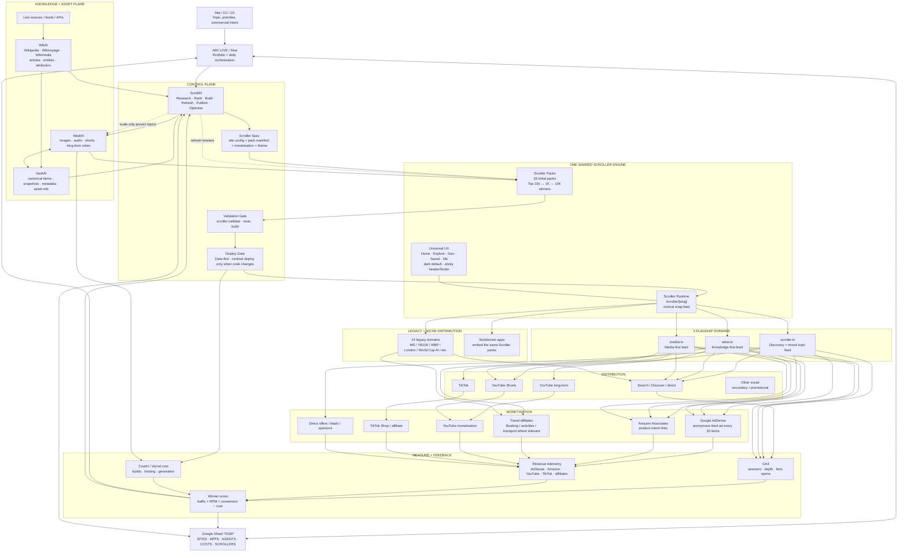
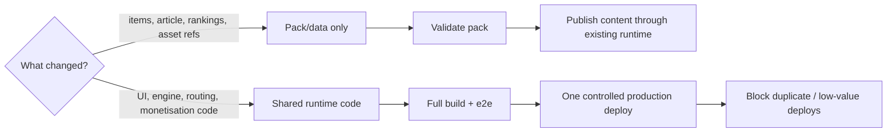

# ScrollAI Ultimate Diagram — 2026-09-10

This is the source-of-truth architecture for the September ScrollAI monetisation push.

## 1G

Build one reusable Scroller system that powers **3 flagship domains**, launches **33 Scrollers**, scales winning packs from **100 → 1K → 10K items**, and drives toward **$100/day gross revenue** without multiplying application code or Vercel builds.

## Master architecture



## Operating rule

**One engine, three flagship domains, many packs.** A new topic creates data, not a new Next.js application.

```text
DJ / topic
  ↓
ScrollAI
  ↓
page.md → items.json → reusable assets → manifest.json
  ↓
validate
  ↓
shared Scroller runtime
  ↓
scroller.tv | wikai.tv | mediai.tv | legacy embeds
  ↓
traffic
  ↓
AdSense + Amazon + travel + YouTube + TikTok + direct offers
  ↓
ABC / CostAI profitability score
  ↓
refresh, rerank, scale winners
```

## Deployment-cost circuit breaker



### Hard rules

1. Do **not** fork Scroller code per topic or per domain.
2. Do **not** deploy for every generated item or media asset.
3. Batch runtime code changes into controlled releases.
4. Prefer data refreshes against the existing runtime.
5. Generate expensive media only after Page + List validate.
6. Reuse WikAI/VaultAI/MediAI assets before generating anything new.
7. Scale only packs with measured traffic/revenue signal.
8. Keep ads out of logged-in feeds and away from navigation.
9. `SCROLLERS` in the *2026* sheet becomes the operational fleet view; SITES/APPS remain portfolio hierarchy.
10. ABC is the portfolio truth; ScrollAI is the Scroller control plane.

## September target state

- **3 flagship sites:** `scroller.tv`, `wikai.tv`, `mediai.tv`.
- **33 Scroller packs** in one fleet view.
- **100 items minimum per new pack**; winners progressively expand to 1K/10K.
- **Same pages/routes/UX contract** across all three domains.
- **AdSense + affiliate disclosure + conversion tracking** wired once at engine level.
- **YouTube long + Shorts + TikTok** fed from the same canonical content/media graph.
- **Single profitability loop:** traffic + revenue − hosting/generation cost.
- September = proof and first revenue signal; October = break-even target; November = positive target.

## Next implementation order

1. Lock this architecture and site/domain routing.
2. Add the `SCROLLERS` fleet model and sheet sync.
3. Define the 3 domain configs using one shared runtime.
4. Create the first 33 pack registry entries without generating new app code.
5. Add monetisation adapters and disclosures once in the shared engine.
6. Add analytics/revenue/cost event schema.
7. Add deployment circuit breaker and batch-release policy.
8. Validate the 3 flagship sites end-to-end.
9. Fill Top 100 packs and reuse existing WikAI/MediAI/VaultAI content.
10. Scale only measured winners.
