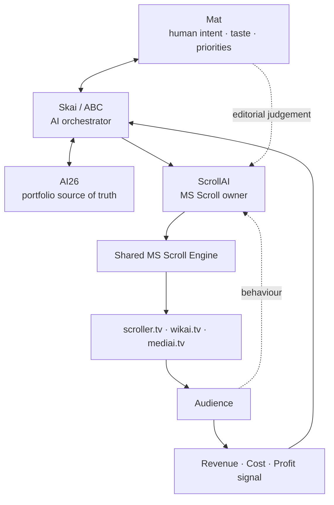
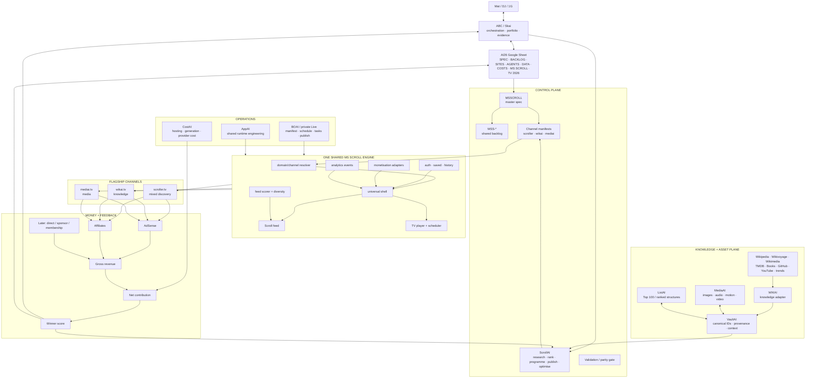
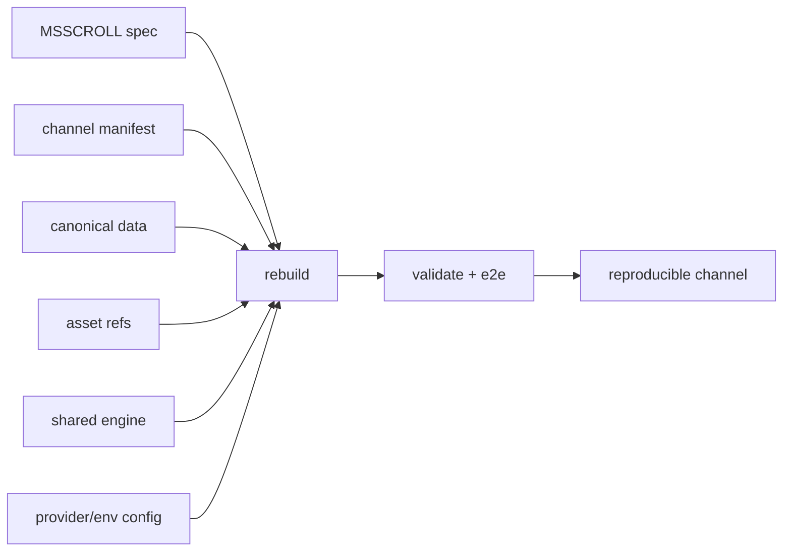
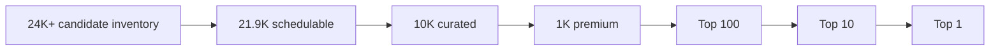
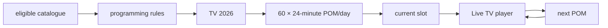
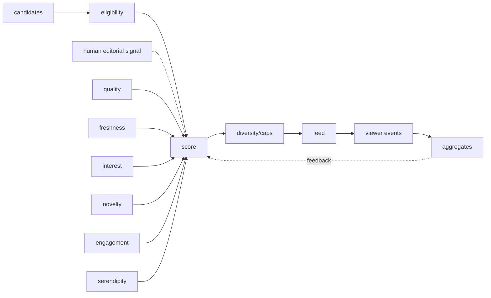
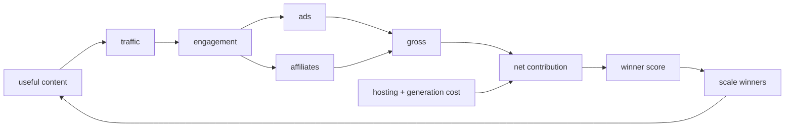
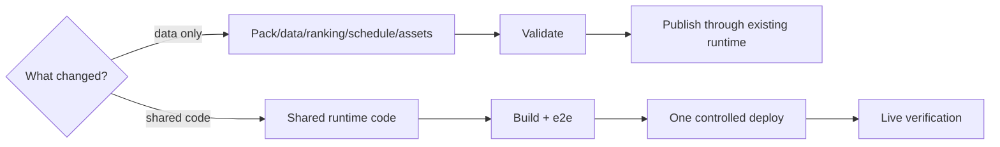
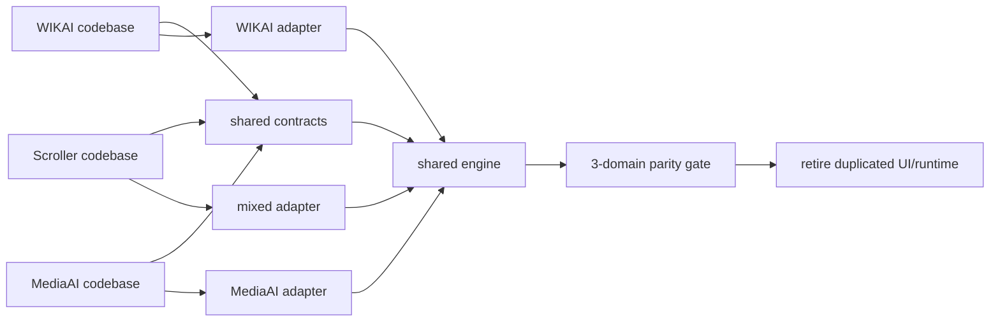
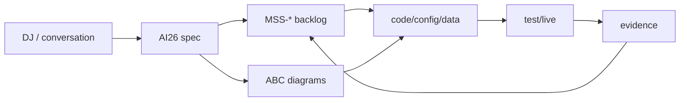

# ScrollAI Ultimate Architecture — 2026-09-13

This document is the portfolio/1G architecture view for ScrollAI and MS Scroll.

For implementation-level diagrams, use:

- `docs/MS-SCROLL-ABC-DIAGRAMS.md`
- `docs/MS-SCROLL-MASTER-SPEC.md`
- `docs/MS-SCROLL-BACKLOG.md`
- `skills/abc-diagrams/SKILL.md`

## 1G objective

Build one reusable Scroll + TV system that powers `scroller.tv`, `wikai.tv`, `mediai.tv`, reuses existing knowledge/media, scales winning packs, and drives toward **$100/day gross revenue** without multiplying codebases, builds or provider spend.

The KPI is a target, not a guarantee.

---

## L0 — Human × AI collaboration



The collaboration model is intentionally asymmetric:

- human chooses direction, taste, risk and final priorities;
- AI researches, structures, generates, tests, measures and proposes;
- evidence returns to the human/ABC loop.

---

## L1 — Master architecture



---

## Operating rule

**One engine, three flagship channels, many packs.**

```text
human idea / live topic / source signal
  ↓
ScrollAI
  ↓
research + canonical item/list/page
  ↓
reuse assets first; enrich only gaps
  ↓
validate eligibility
  ↓
shared runtime
  ↓
scroller.tv | wikai.tv | mediai.tv
  ↓
Scroll / TV / Latest / Top
  ↓
traffic + engagement
  ↓
AdSense + affiliates + later direct offers
  ↓
revenue − cost
  ↓
ABC / CostAI winner score
  ↓
refresh / rerank / scale proven winners
```

A new topic creates data/pack state. A new channel creates a manifest + adapters/data. Neither should automatically create a new application fork.

---

## Rebuild contract



Undocumented live tweaks are drift; they must be pulled back into the spec/config.

---

## Content quality ladder



The exact intermediate quality tiers are evidence-driven, not arbitrary guarantees.

---

## TV system



- 60 × 24 minutes = 24 hours/day.
- 21,900 POM slots/year.
- Catalogue can exceed the linear schedule capacity.

---

## Feed intelligence



Start explainable; add heavier personalisation only when data justifies it.

---

## Monetisation loop



Unknown provider telemetry stays unknown; never convert missing values to zero.

---

## Deployment-cost circuit breaker



### Hard rules

1. Do **not** fork Scroller code per topic/domain.
2. Do **not** deploy for every generated item/media asset.
3. Batch shared-runtime code changes into controlled releases.
4. Prefer data/config refreshes against the existing runtime.
5. Generate expensive media only after useful text/list stages validate.
6. Reuse WIKAI/VaultAI/MediaAI assets before generation.
7. Scale only items/topics with measured value.
8. Keep monetisation away from primary navigation and comply with provider/consent rules.
9. AI26 is the human/portfolio source of truth.
10. ScrollAI is the MS Scroll control plane; ABC is the portfolio orchestrator.

---

## Migration



Specialist data/media services may remain separate. The goal is to eliminate duplicated product/runtime layers, not to force every subsystem into one process.

---

## Source-of-truth loop



Architecture-changing decisions must update the diagram atlas in the same documentation change.

Full detailed diagrams: `docs/MS-SCROLL-ABC-DIAGRAMS.md`.
